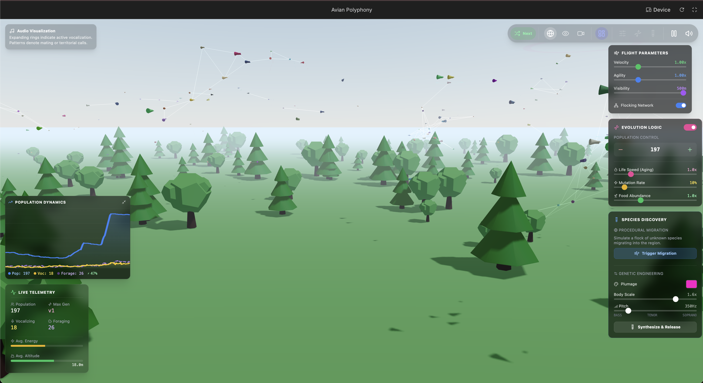
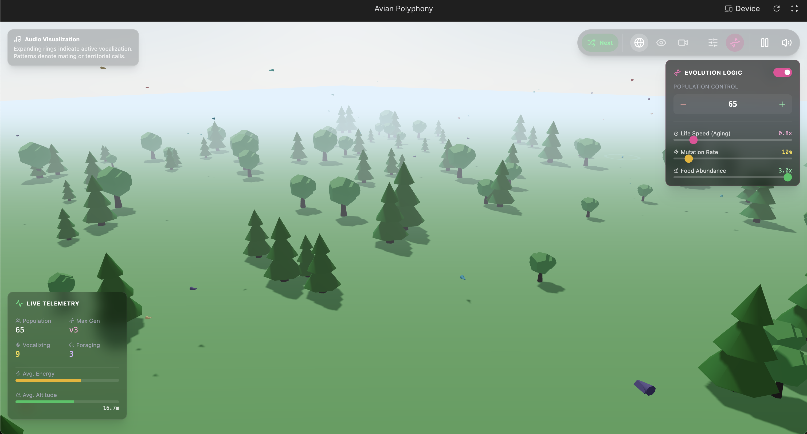
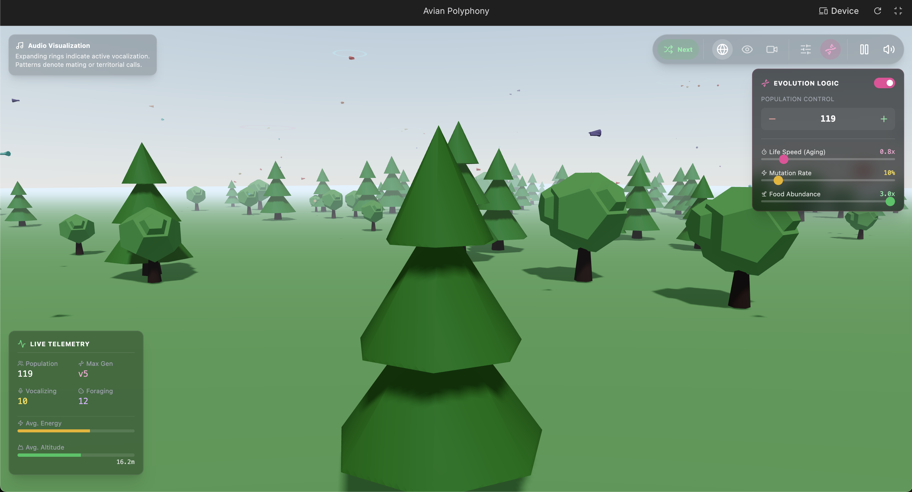

# avian-polyphony

## Quick intro

> [!TIP]
> See:

[README in `docs`](./docs/); full [DESCRIPTION](./docs/DESCRIPTION.md); technical: [ARCHITECTURE](./docs/ARCHITECTURE.md)

### Cute ridiculous bird "ecology" sandbox.

A quick experiment using `gemini-3-pro-preview` in AI Studio. **Ridiculous but nifty low poly birb ecology / vibe sandbox**

Project can be maybe possibly used to further prototype ideas atop this as well as use as basis for exploring some half-simulation-half-flaky-aesthetics sandbox concepts; maybe.

Initial repo (apart these notices here and there) is output of `gemini-3-pro-preview` model in AI Studio and really is just my wanting to play around with it; with vibe coding. There, I said it.

# Warning

> [!CAUTION]
> "is output of `gemini-3-pro-preview` model in AI Studio" is not an exaggeration. Use **CAUTION, COMMON SENSE and DO NOT TRUST** code or docs in `DESCRIPTION` and `ARCHITECTURE`.

# Docs

See [`docs` directory](./docs/)

# Screenshots

> [!TIP]
> In UI, click on Dashboard icon to expand most UI widgets and see most features (save for individual bird info description; unless I forgot something which is possible): . First screenshot has Dashboard enabled. Also, try increasing Flight parameters -> Visibility.

  
  
  
  
  
  
  
  

# Run and deploy your AI Studio app

This was (at least initially) created and is (as of now) prototyped in AI Studio, so you should be able to import this thing there. Or ping me so I can share that Drive URL linking to Studio project to you / so you can make a copy to your Drive. I've just started poking on AI Studio myself though. If I continue poking around, I may deploy locally. In that case I will review the below and update/expand as necessary. But right now this is just a quick PoC draft.

## Run Locally

**Prerequisites:**  Node.js

1. Install dependencies:
   `npm install`
2. Set the `GEMINI_API_KEY` in [.env.local](.env.local) to your Gemini API key
   - **NOTE from human**: only the "get bird name and description" feature/aspect should depend on this, everything else *should* be generated locally, procedurally
     - Obviously this particular feature/aspect can also be made to work through local simple procedural means. (Or, well, vice versa, more (maybe even nifty) LLM-live-fetched-and-rendered stuff could be added. But I personally would like this PoC to ideally depend on LLM API only for optional features (which don't stop app functioning properly when off and/or when not able to call this API. This later local-only robust functionality requires app changes, however. But should be easy to do.)
4. Run the app:
   `npm run dev`
