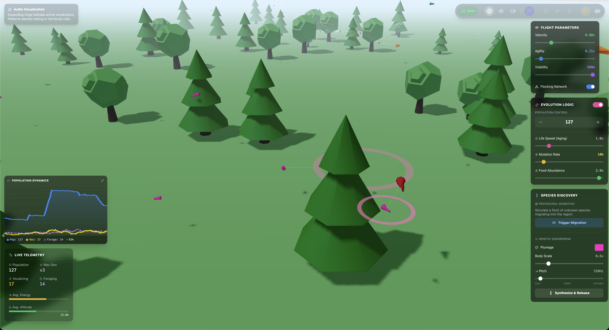
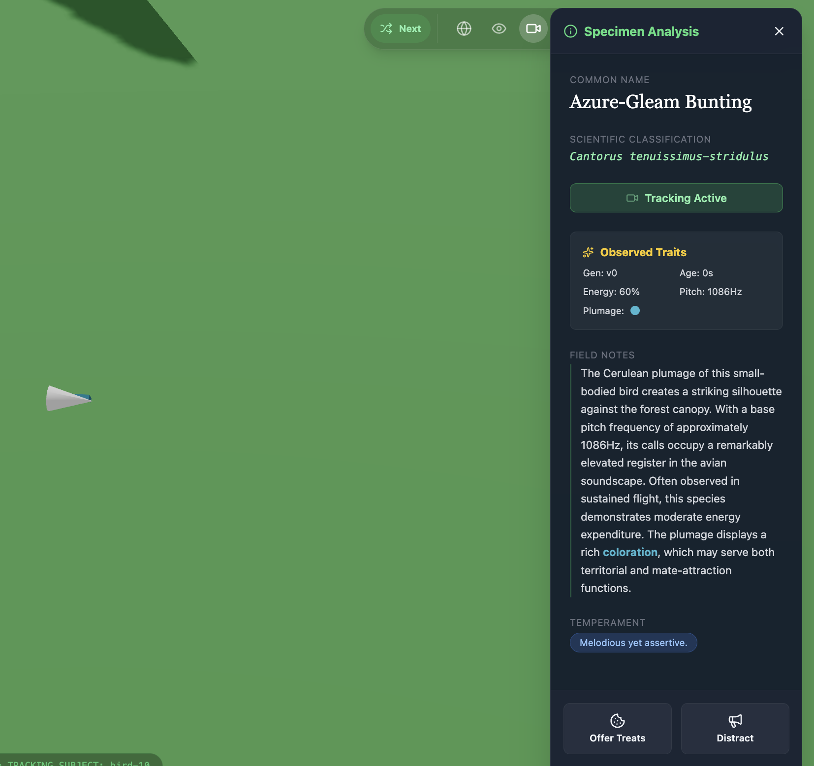
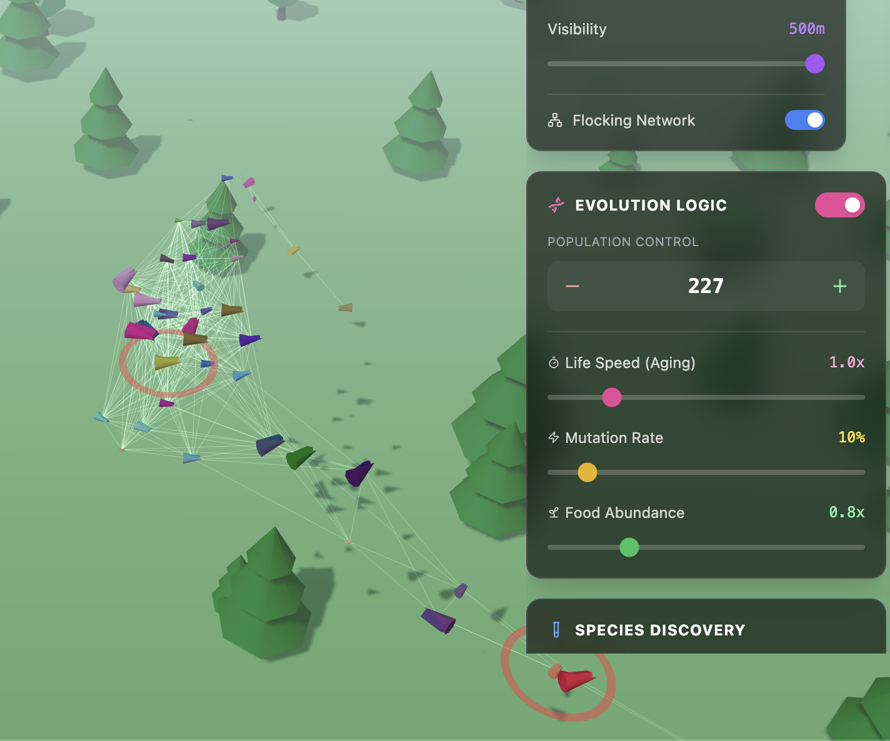

# xenogenesis

**Life, but not as we know it.**

A composable framework for exploring emergence and evolution across impossible substrates—from flocking birds to high-dimensional alien cognition.

---

> [!TIP]
> **TL;DR / Quick Start:** Want to see something concrete? Jump to **[avian-polyphony](./avian-polyphony/)** - a working simulation of evolutionary flocking birds with procedural audio, genetic evolution, and species nomenclature. [Full documentation here](./avian-polyphony/README.md).

<p align="center">
  
  <br>
  <sub><i>avian-polyphony: Exploring evolution through flocking agents with real-time population dynamics</i></sub>
</p>

<p align="center">
  
  
  <br>
  <sub><i>Left: Deterministic species nomenclature system. Right: Flocking behaviors with spatial audio.</i></sub>
</p>

---

## What This Is

**xenogenesis** is a computational laboratory for asking: *"What forms could life take if the rules were different?"*

Not a simulator of Earth biology, but a framework for exploring the adjacent possible—systems that *could* exhibit life-like complexity, evolution, and emergence, but use different substrates, different genetics, different physics.

Inspired by Greg Egan's *Wang's Carpets* and the tradition of artificial life research, xenogenesis provides composable, toggle-able systems for building and studying:

- **Evolutionary dynamics** with pluggable genetics models (Mendelian, Lamarckian, epigenetic, horizontal transfer)
- **Emergent behaviors** via modular behavior trees and agent interactions
- **Procedural ecosystems** that surprise even their designers
- **Artistic + scientific exploration** of complexity and emergence

Each module is a self-contained experiment. Each experiment explores a different question about what life could be.

---

## Current Modules

### 🐦 [avian-polyphony](./avian-polyphony/) → [**Full README**](./avian-polyphony/README.md)
**Exploring evolution through flocking agents**

A 3D browser-based simulation of bird-like agents with:
- Boids-based flocking (separation, alignment, cohesion)
- Procedural vocalizations and spatial audio
- Genetic evolution with mutation and inheritance
- Deterministic species nomenclature (25 color families, Latin binomial names)
- Real-time population dynamics and visualization

**Status:** Active development
**Documentation:** [README](./avian-polyphony/README.md) | [Architecture](./avian-polyphony/docs/ARCHITECTURE.md) | [Development Roadmap](./avian-polyphony/docs/DEVELOPMENT_ROADMAP.md)

```bash
cd avian-polyphony && npm install && npm run dev
# Open http://localhost:3000
```

---

## Philosophy

> *"In the vast space of possible forms of life, Earth biology is a single point. What else is out there in that space? What could we create, given different rules?"*

Traditional biology studies life *as it is*.
Artificial life studies life *as it could be*.
**xenogenesis studies life *as it never was*.**

We're interested in:
- **Computational substrates** that exhibit emergent complexity (cellular automata, agent systems, neural networks)
- **Evolutionary dynamics** under different inheritance models
- **Speculative ecology** where familiar concepts (predation, symbiosis, competition) play out in unfamiliar ways
- **Generative art** where aesthetic beauty emerges from algorithmic rules
- **Serious play** as a methodology for discovery

This is science fiction made real—not as prediction, as *exploration*.

[Read more: Philosophy and Influences](./docs/philosophy.md)

---

## Design Principles

1. **Composability** - Systems are modular plugins, not monolithic simulations
2. **Toggle-ability** - Every feature can be turned on/off to isolate effects
3. **Determinism** - Same initial conditions → same outcomes (when desired)
4. **Local-first** - No external dependencies, runs entirely in browser
5. **Exploration over accuracy** - We're exploring possibility space, not replicating Earth
6. **Beauty + Rigor** - Aesthetically pleasing AND scientifically grounded (*note*: grounded as in using instruments such as the scientific method as our basis (**form**); not "grounded" as in "based on our environment's set of established facts" (extant ~~**content**~~))

---

## Roadmap

**xenogenesis** will grow through:

1. **Deepening existing modules** (genotype/phenotype systems, behavior trees, sexual reproduction)
2. **Adding new substrates** (cellular automata, neural swarms, chemical systems)
3. **Cross-module learning** (behaviors evolved in one context, tested in another)
4. **Emergent narratives** (tracking interesting dynamics, documenting discoveries)
5. **Community experiments** (shareable configurations, reproducible findings)

See: [Cross-Module Roadmap](./docs/ROADMAP.md) (future)

---

## Influences & Inspirations

- **Greg Egan's *Wang's Carpets*** - High-dimensional alien life in polysaccharide substrates
- **Christopher Langton's Artificial Life** - Life as a property of organization, not material
- **Conway's Game of Life** - Complexity from simple rules
- **Bret Victor's *Inventing on Principle*** - Immediate feedback for exploratory thinking
- **Proteus (video game)** - Procedural beauty, contemplative interaction
- **Karl Sims' Evolved Virtual Creatures** - Evolution of morphology and behavior
- **Richard Dawkins' *The Blind Watchmaker*** - Biomorphs and evolutionary computation

---

## Contributing

**xenogenesis** is an experimental research project. Contributions are welcome (genuinely desired), but expect:
- Rapid iteration and breaking changes
- Unconventional ideas and failed experiments
- Code that prioritizes exploration over production polish

If you want to:
- **Propose a new module** - Open an issue describing the substrate/question
- **Improve existing modules** - PRs welcome, follow existing patterns
- **Report interesting emergent behaviors** - Document and share configurations
- **Discuss philosophy** - Engage in issues/discussions

---

## License

MIT - Build strange life, share what you find.

---

## Contact

Kostas (*wfn*)
Questions, collaborations, philosophical debates, rants on author's hubris: Contact: [homepage->footer](https://kfs.mkj.lt/#lastfooter) (phone/signal & email; see email notice at the bottom)

---

*The [Wang's Carpets](https://en.wikipedia.org/wiki/Wang_tile) drifted through the oceanic depths of Orpheus, filtering the heavy water for food, absorbing the dim violet light. They were not intelligent. They were barely even sentient. But the pattern of polysaccharides they embodied was a kind of two-dimensional hypergraph, endlessly constructing itself, endlessly complex.*

— Greg Egan, *Wang's Carpets* ([short story](https://en.wikipedia.org/wiki/Wang%27s_Carpets); later became part of his novel [Diaspora](https://en.wikipedia.org/wiki/Diaspora_(novel)))
