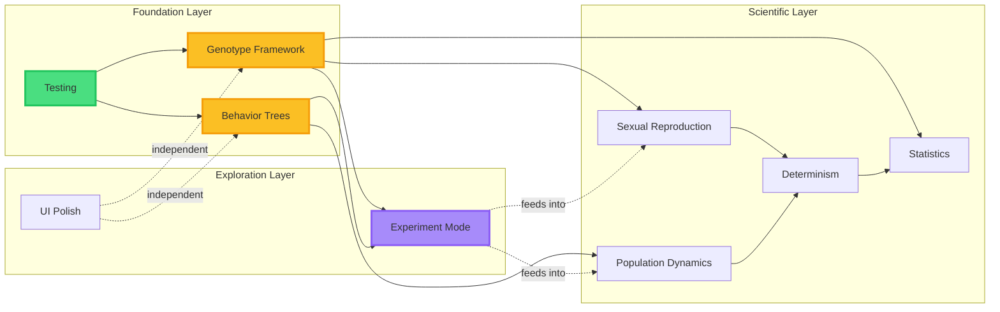
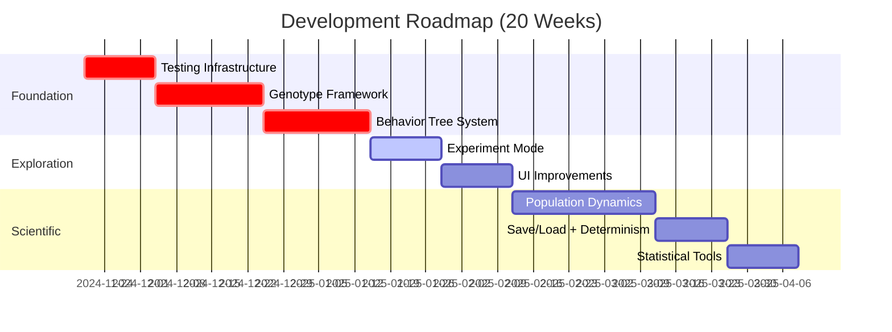

# Development Roadmap - Visual Guide

**Philosophy:** Building a flexible computational laboratory for exploring evolutionary/ecological possibility space.

**Key Principle:** Genotype/phenotype abstraction as foundation, but designed for EXPLORATION not just Earth-realism.

---

## Phase Overview

```mermaid
graph TD
    subgraph "PHASE 1: Safety Net (Weeks 1-2)"
        A1[Testing Infrastructure]
        A1 --> A2[Unit Tests: Nomenclature & Boids]
        A1 --> A3[Integration: Bird Lifecycle]
        A1 --> A4[Test Runner Setup]

        style A1 fill:#4ade80,stroke:#22c55e,stroke-width:3px
    end

    subgraph "PHASE 2: Flexible Foundation (Weeks 3-5)"
        B1[Genotype/Phenotype Framework]
        B1 --> B2[Pluggable Expression Models]
        B1 --> B3[Default: Mendelian Diploid]
        B1 --> B4[Architecture for Future Models]
        B2 -.-> B5[Future: Lamarckian]
        B2 -.-> B6[Future: Epigenetic]
        B2 -.-> B7[Future: Horizontal Transfer]

        style B1 fill:#fbbf24,stroke:#f59e0b,stroke-width:3px
        style B5 fill:#ddd,stroke:#999,stroke-dasharray: 5 5
        style B6 fill:#ddd,stroke:#999,stroke-dasharray: 5 5
        style B7 fill:#ddd,stroke:#999,stroke-dasharray: 5 5
    end

    subgraph "PHASE 3: Composability (Weeks 6-8)"
        C1[Behavior Tree System]
        C1 --> C2[Composite Nodes: Sequence/Selector]
        C1 --> C3[Leaf Nodes: Actions]
        C1 --> C4[Pluggable Registry]
        C1 --> C5[UI: Behavior Manager]

        style C1 fill:#fbbf24,stroke:#f59e0b,stroke-width:3px
    end

    subgraph "PHASE 4: Experiment Mode (Weeks 9-10)"
        D1[Experimental Configurations]
        D1 --> D2[Preset Experiments]
        D1 --> D3[Experiment Loader UI]
        D1 --> D4[Hypothesis Tracking]
        D2 --> D5["Earth-like Config"]
        D2 --> D6["Custom Configs"]

        style D1 fill:#a78bfa,stroke:#8b5cf6,stroke-width:3px
    end

    subgraph "PHASE 5: Polish (Weeks 11-12)"
        E1[UI Improvements]
        E1 --> E2[Layout: All Panels Visible]
        E1 --> E3[Camera: Follow Enhancements]
        E1 --> E4[Render Distance Slider]
        E1 --> E5[Tooltips & Shortcuts]

        style E1 fill:#60a5fa,stroke:#3b82f6,stroke-width:2px
    end

    subgraph "PHASE 6: Ecological Depth (Weeks 13-16)"
        F1[Population Dynamics]
        F1 --> F2[Sexual Reproduction]
        F1 --> F3[Mate Choice Behaviors]
        F1 --> F4[Resource Distribution]
        F1 --> F5[Carrying Capacity]

        style F1 fill:#34d399,stroke:#10b981,stroke-width:2px
    end

    subgraph "PHASE 7: Persistence (Weeks 17-18)"
        G1[Save/Load + Determinism]
        G1 --> G2[Full State Serialization]
        G1 --> G3[Deterministic PRNG]
        G1 --> G4[Replay Recording]

        style G1 fill:#f472b6,stroke:#ec4899,stroke-width:2px
    end

    subgraph "PHASE 8: Analysis (Weeks 19-20)"
        H1[Scientific Tools]
        H1 --> H2[Trait Distribution Plots]
        H1 --> H3[Genetic Diversity Metrics]
        H1 --> H4[Time Series Analysis]
        H1 --> H5[CSV Export]

        style H1 fill:#fb923c,stroke:#f97316,stroke-width:2px
    end

    A1 --> B1
    B1 --> C1
    C1 --> D1
    D1 --> E1
    E1 --> F1
    F1 --> G1
    G1 --> H1

    B1 -.->|enables| F2
    C1 -.->|enables| F3
    B1 -.->|enables| H3
```



---

## Dependency Map



---

## Critical Path Timeline



---

## Phase Details

### 🟢 Phase 1: Testing Infrastructure (Weeks 1-2)
**Status:** Foundation
**Risk:** Low | **Value:** High

**Deliverables:**
- [ ] Unit tests for `birdNomenclature.ts` (determinism, edge cases)
- [ ] Unit tests for boids calculations (separation, alignment, cohesion)
- [ ] Integration test: bird lifecycle (birth → reproduce → death)
- [ ] Test runner setup (Vitest/Jest)
- [ ] CI/CD if applicable

**Success Criteria:**
- Can run `npm test` and see green
- Coverage for pure functions >80%
- Can add new tests easily

---

### 🟡 Phase 2: Genotype/Phenotype Framework (Weeks 3-5)
**Status:** Foundation (CRITICAL)
**Risk:** High | **Value:** Very High

**Philosophy:** Build for FLEXIBILITY, not Earth-realism

**Core Abstraction:**
```typescript
interface Genotype {
  genes: Map<string, GeneData>
  expressionModel: 'mendelian' | 'lamarckian' | 'epigenetic' | ...
  inheritanceModel: 'sexual' | 'asexual' | 'horizontal' | ...
}

function expressPhenotype(
  genotype: Genotype,
  environment: EnvContext,
  model: ExpressionModel
): Phenotype
```

**Deliverables:**
- [ ] `Genotype` interface with pluggable models
- [ ] Mendelian diploid implementation (DEFAULT, working)
- [ ] Trait expression: color, size, pitch from genes
- [ ] Genetic operators: crossover, mutation
- [ ] Tests for Mendelian inheritance ratios
- [ ] Placeholder architecture for future models (documented)
- [ ] Update `BirdData` to include genotype
- [ ] Refactor reproduction logic to use genotypes

**Success Criteria:**
- Birds inherit traits via genes (not direct copying)
- Can toggle between asexual and sexual (sexual placeholder OK)
- Tests show expected inheritance patterns
- Code supports adding new models without major refactor

**Future Models (NOT implemented yet, just designed for):**
- Lamarckian: Acquired traits can become heritable
- Epigenetic: Environment affects gene expression
- Horizontal transfer: Genes can move between unrelated birds
- Alien: Non-diploid, non-Mendelian systems

---

### 🟡 Phase 3: Behavior Tree System (Weeks 6-8)
**Status:** Foundation (CRITICAL)
**Risk:** Medium | **Value:** Very High

**Philosophy:** Enable rapid behavior experimentation

**Deliverables:**
- [ ] Behavior tree implementation (`services/behaviorTree.ts`)
  - [ ] Composite nodes: Sequence, Selector, Parallel
  - [ ] Decorator nodes: Inverter, Repeater, UntilFail
  - [ ] Leaf nodes: ForageAction, FlockAction, SingAction
- [ ] Behavior registry (add/remove behaviors at runtime)
- [ ] Integrate with `Bird.tsx` (replace hardcoded state machine)
- [ ] UI: "Behaviors" panel in dashboard
  - [ ] Toggle behaviors on/off
  - [ ] Adjust behavior weights/priorities
  - [ ] Visual indicator when behavior is active
- [ ] Tests for behavior execution

**Success Criteria:**
- Can add new behavior without editing core `Bird.tsx`
- Can toggle behaviors on/off in UI and see immediate effect
- Behavior execution is deterministic (same inputs → same outputs)

---

### 🟣 Phase 4: Experiment Mode (Weeks 9-10)
**Status:** Exploration (NEW)
**Risk:** Low | **Value:** High

**Philosophy:** Make exploration concrete, preserve discoveries

**Deliverables:**
- [ ] Experiment configuration system (`experiments/experimentRegistry.ts`)
- [ ] Preset experiments:
  - [ ] "Earth-like" (Mendelian + standard behaviors)
  - [ ] "Custom" (user-defined)
- [ ] UI: "Experiment Loader" panel
  - [ ] Load/save experiment configs
  - [ ] Document hypothesis
  - [ ] Compare results
- [ ] Experiment metadata (date, description, results)

**Success Criteria:**
- Can load "Earth-like" config and run
- Can save custom config for later
- Can document what each experiment is testing

---

### 🔵 Phase 5: UI Improvements (Weeks 11-12)
**Status:** Polish
**Risk:** Low | **Value:** Medium

**Philosophy:** Quick wins, better usability

**Deliverables:**
- [ ] Layout: All panels visible simultaneously (no overlap)
- [ ] Camera: Adjustable follow distance/angle
- [ ] Render distance slider (LOD if needed)
- [ ] Tooltips on all parameters
- [ ] Keyboard shortcuts
- [ ] Consistent spacing/typography

**Success Criteria:**
- Dashboard mode shows everything without scrolling
- Can adjust camera while following bird
- UI feels polished

---

### 🟢 Phase 6: Ecological Depth (Weeks 13-16)
**Status:** Scientific
**Risk:** Medium | **Value:** High

**Philosophy:** Test the foundations, create complexity

**Deliverables:**
- [ ] Sexual reproduction (uses genotype framework)
  - [ ] Male/female differentiation
  - [ ] Mate choice behavior (uses behavior trees)
  - [ ] Courtship displays
  - [ ] Genetic crossover
- [ ] Population dynamics
  - [ ] Patchy resource distribution
  - [ ] Carrying capacity (density-dependent mortality)
  - [ ] Territoriality behavior
- [ ] UI: Mating indicators, resource visualization

**Success Criteria:**
- Sexual reproduction produces viable offspring
- Mate choice shows preference patterns
- Population self-regulates around carrying capacity
- Can observe emergent territorial behaviors

---

### 🩷 Phase 7: Save/Load + Determinism (Weeks 17-18)
**Status:** Scientific (CRITICAL)
**Risk:** High | **Value:** Very High

**Philosophy:** Reproducibility enables science AND art

**Deliverables:**
- [ ] Full state serialization
  - [ ] Birds (genotype, phenotype, position, state)
  - [ ] Environment (trees, resources)
  - [ ] Settings (all parameters)
- [ ] Save/load to JSON files
- [ ] Deterministic mode
  - [ ] Seed-based PRNG (replace Math.random())
  - [ ] Reproducible physics (careful with Three.js)
  - [ ] No Date.now() dependencies
- [ ] Replay recording (save decision log)
- [ ] UI: Save/load buttons, seed input

**Success Criteria:**
- Can save interesting run, reload, continue
- Same seed → identical simulation (deterministic mode)
- Can replay a run from recording

**Note:** Determinism is HARD. Start with save/load, add determinism incrementally.

---

### 🟠 Phase 8: Statistical Tools (Weeks 19-20)
**Status:** Scientific
**Risk:** Low | **Value:** Medium

**Philosophy:** Quantify and analyze emergent dynamics

**Deliverables:**
- [ ] Real-time statistics
  - [ ] Trait distribution histograms (color, size, pitch)
  - [ ] Genetic diversity metrics (heterozygosity, allele freq)
  - [ ] Behavioral time budgets
- [ ] Time series visualization (track traits over generations)
- [ ] Correlation analysis
- [ ] CSV export for external analysis (R, Python)
- [ ] UI: "Statistics" panel with graphs

**Success Criteria:**
- Can see trait distributions update in real-time
- Can export data and analyze in external tools
- Can detect interesting patterns (oscillations, extinctions)

---

## Decision Points

### After Phase 2 (Genotype System)
**Question:** Is the genotype abstraction working? Is it flexible enough?

**Options:**
- ✅ Continue → Move to behavior trees
- ⚠️ Refine → Spend 1 more week iterating on genotype design
- ❌ Pivot → Fall back to simpler trait inheritance (unlikely)

### After Phase 4 (Experiment Mode)
**Question:** What experiments are interesting? What models should we add?

**Options:**
- Add Lamarckian model (acquired traits heritable)
- Add horizontal transfer model (gene sharing)
- Add epigenetic model (environment → expression)
- Focus on behaviors instead of genetics
- Explore something completely different

### After Phase 6 (Ecological Depth)
**Question:** Is sexual reproduction adding interesting dynamics?

**Options:**
- ✅ Yes → Keep building on it (speciation, lineage tracking)
- ⚠️ Partial → Simplify or make optional
- ❌ No → Remove, focus on asexual + behaviors

---

## Deferred (But Not Forgotten)

These are in `FUTURE_WORK.md` but NOT in the critical path:

- **Audio enhancements** (Section 4) - Works fine now, can enhance later
- **Graphics improvements** (Section 3) - Polish after mechanics are solid
- **Neural networks** (Section 6.2) - Needs everything else first
- **Speciation** (Section 5.4) - Needs many generations of stable evolution
- **Game elements** (Section 9) - May never be relevant

---

## Success Metrics

### Technical Health
- [ ] Tests pass (green CI)
- [ ] No performance regressions (60 FPS with 100+ birds)
- [ ] Code is documented (README, ARCHITECTURE.md up to date)

### Scientific Progress
- [ ] Can observe interesting emergent behaviors
- [ ] Can reproduce findings (determinism works)
- [ ] Can export data for analysis

### User Experience
- [ ] UI is intuitive (can show to someone unfamiliar)
- [ ] Can save/load interesting runs
- [ ] No major bugs or frustrations

### Exploration Velocity
- [ ] Can add new behavior in <1 day
- [ ] Can test new genetics model in <1 week
- [ ] Can run experiments and compare results

---

## Daily Reference

**Currently Working On:** _______________
**Current Phase:** _______________
**Next Milestone:** _______________
**Blockers:** _______________

**Quick Links:**
- `docs/FUTURE_WORK.md` - Full roadmap
- `docs/ARCHITECTURE.md` - Technical details
- `CLAUDE.md` - LLM briefing
- `types.ts` - Interfaces
- `components/World.tsx` - Simulation core
- `services/` - Pure logic

---

## Principles (Always Remember)

1. **Flexibility > Perfection** - Build for exploration, not fixed simulation
2. **Composability > Features** - Plugin architecture enables rapid iteration
3. **Test as you go** - Tests are insurance, not overhead
4. **Document discoveries** - Interesting emergent behaviors should be preserved
5. **Question assumptions** - "What if..." is the most important question
6. **Time-box experiments** - Don't chase rabbits forever
7. **Embrace failures** - Some experiments will be boring - that's data
